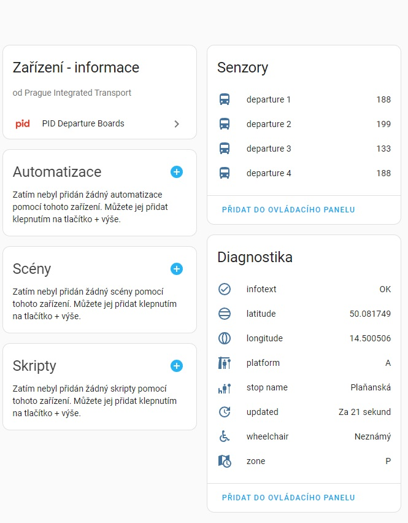

# PID Departure Board integration

The custom component is current in BETA. **Beware of using it in your production instance** (may cause unexpected behaviour or crashes).

This custom component provides a departures board information for the selected stops. 

Multiple departure boards can be configured.

| Device page                              |                  Sensor attributes                   |
|:-----------------------------------------|:----------------------------------------------------:|
|  |  |

## Installation

### Using [HACS](https://hacs.xyz/)

Not yet supported.

### Manual

To install this integration manually you have to download pid_integration folder into your config/custom_components folder.

## Configuration

### Using UI

From the Home Assistant front page go to **Configuration** and then select **Integrations** from the list.

Use the "plus" button in the bottom right to add a new integration called **PID Departure boards**.

Fill in:

 - stop aswIds either from the formatted_stops.txt file in the repository (easier) 
 - API key (if you don't have the API key, you can obtain it here: https://api.golemio.cz/api-keys/auth/sign-up) and 
 - number of departures to be displayed.

Alternatively, the aswIds may be obtained directly or from  stops.txt file in GTFS files here: https://opendata.praha.eu/datasets/https%3A%2F%2Fapi.opendata.praha.eu%2Flod%2Fcatalog%2F9a6a1d8e-45b9-41de-b9ae-0bcec7126876 (asw_zone_id and asw_stop_id must be joined using "_" to get aswIds).

The success dialog will appear or an error will be displayed in the popup.