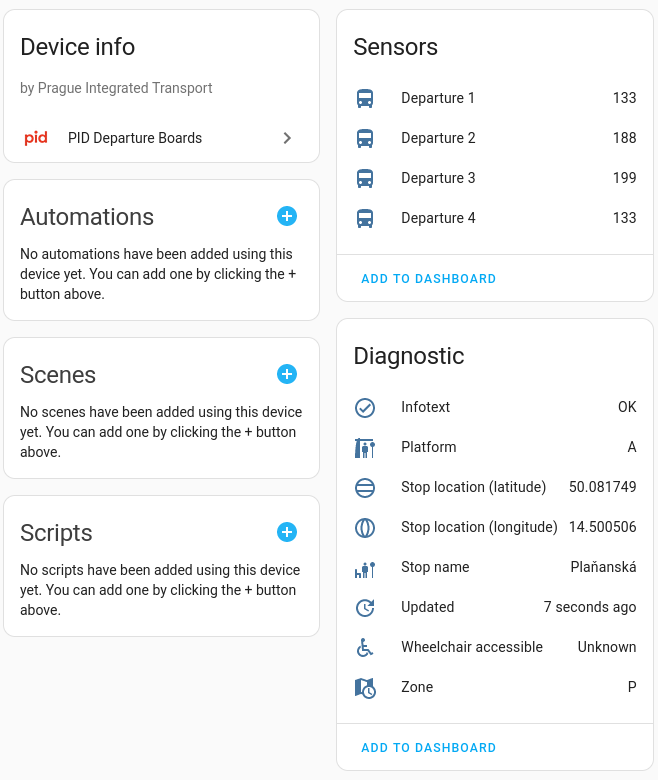
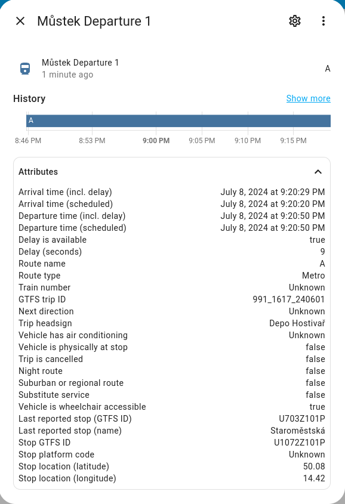

# PID Departure Board integration

This custom component provides a departures board information for the selected stops of the Prague Integrated Transport [PID](http://www.pid.cz/). 

Multiple departure boards can be configured.

| Device page                                     |                  Sensor attributes                   |
|:------------------------------------------------|:----------------------------------------------------:|
|  |  |

## Installation

### Using [HACS](https://hacs.xyz/)

### Manual

To install this integration manually you have to download pid_departures folder into your config/custom_components folder.

## Configuration

### Using UI

From the Home Assistant front page go to **Configuration** and then select **Integrations** from the list.

Use the "plus" button in the bottom right to add a new integration called **PID Departure boards**.

Fill in:
 
 - API key (if you don't have the API key, you can obtain it here: https://api.golemio.cz/api-keys/auth/sign-up), 
 - number of departures to be displayed,
 - choose a stop from the list, and
 - number of calendar events for departures to be created.

It is only required to fill in API key once - for additional departure boards it should be prefilled in the config dialogue.

The success dialog will appear or an error will be displayed in the popup.

## Dashboard

The repo includes example card based on [Flex-table-card](https://github.com/custom-cards/flex-table-card) for display on dashboard.

Just modify the headline and the departure entity name - number in the name shall be replaced by * to include all departures.

 