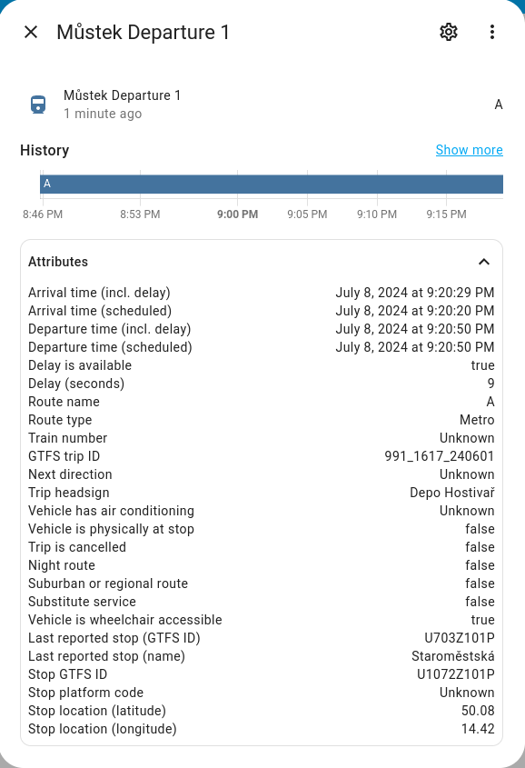
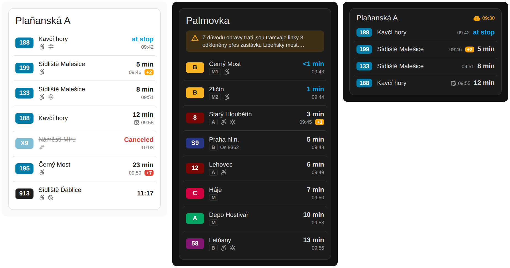

# PID Departure Board integration

This custom component provides a departures board information for the selected stops of the Prague Integrated Transport [PID](http://www.pid.cz/). 

Multiple departure boards can be configured.

| Device page                                     |                  Sensor attributes                   |
|:------------------------------------------------|:----------------------------------------------------:|
|  |  |

## Installation

### Using [HACS](https://hacs.xyz/)

[](https://my.home-assistant.io/redirect/hacs_repository/?owner=dvejsada&repository=PID_integration&category=Integration)

### Manual

To install this integration manually you have to download pid_departures folder into your config/custom_components folder.

## Configuration

### Using UI

From the Home Assistant front page go to **Configuration** and then select **Integrations** from the list.

Use the "plus" button in the bottom right to add a new integration called **PID Departure boards**.

Fill in:
 
 - API key (if you don't have the API key, you can obtain it here: https://api.golemio.cz/api-keys/auth/sign-up), 
 - number of departures to be displayed,
 - choose a stop from the list, and
 - number of calendar events for departures to be created.

It is only required to fill in API key once - for additional departure boards it should be prefilled in the config dialogue.

The success dialog will appear or an error will be displayed in the popup.

## Dashboard

The integration comes with its own dashboard card. It is loaded automatically, there is no need to add a dashboard resource or install anything from HACS. After installing or updating the integration, restart Home Assistant and reload the browser.



Add it from the dashboard editor (search for **PID Departures**) and pick one or more departure boards. Everything can be set in the visual editor, or in YAML:

```yaml
type: custom:pid-departures-card
devices:
  - 1a2b3c4d5e6f...          # departure board device, pick it in the visual editor
```

Selecting several boards (e.g. both platforms of the same stop) merges their departures into one list sorted by time and shows the platform of each departure.

| Option           | Default               | Description                                                                                           |
|:-----------------|:----------------------|:------------------------------------------------------------------------------------------------------|
| `devices`        | *required*            | Departure board devices to show.                                                                      |
| `title`          | stop name             | Card title.                                                                                           |
| `max_departures` | all                   | Maximum number of departures shown. The integration's "number of departures" setting is the upper limit. |
| `time_format`    | `both`                | `both` (countdown and scheduled time), `relative` (countdown only) or `absolute` (scheduled time only). |
| `show_header`    | `true`                | Show the title.                                                                                       |
| `show_infotext`  | `true`                | Show the service alert of the stop, if any. Tap it to expand.                                         |
| `show_delay`     | `true`                | Show delay badges and mark departures without real-time data.                                         |
| `show_platform`  | `true` for 2+ boards  | Show the platform code of each departure.                                                             |
| `hide_departed`  | `true`                | Hide departures that have already left.                                                               |
| `compact`        | `false`               | One line per departure, for wall panels and narrow columns.                                           |

How to read the card:

- The countdown is recalculated by the browser every 15 seconds, while the data are refreshed from the API once a minute. It is rounded down, so the card never promises more time than there is.
- The time below the countdown is the scheduled departure, the badge next to it the delay in minutes (orange up to 4 minutes, red from 5). The calendar icon means there are no real-time data for the trip and the timetable is shown.
- A cloud icon with a time in the header means the data have not been updated for more than 3 minutes (e.g. the API is down).
- Tapping a departure opens its details with all attributes.
- All values sit in fixed columns, so a delay, a cancellation or a long label never shifts the other rows. The layout adapts to the card width: one line per departure on wide cards, the time moves under the countdown on medium ones, and on narrow ones the destination gets its own line.

The line colours follow the PID colours and can be changed with a theme, e.g. `pid-color-tram: "#a00000"`. Available variables: `pid-color-tram`, `pid-color-bus`, `pid-color-trolleybus`, `pid-color-train`, `pid-color-ferry`, `pid-color-funicular`, `pid-color-night`, `pid-color-metro-a`, `pid-color-metro-b`, `pid-color-metro-c`.

### Flex-table-card

The repo also includes an example card based on [Flex-table-card](https://github.com/custom-cards/flex-table-card) (`card.yaml`). Just modify the headline and the departure entity name - number in the name shall be replaced by * to include all departures.
