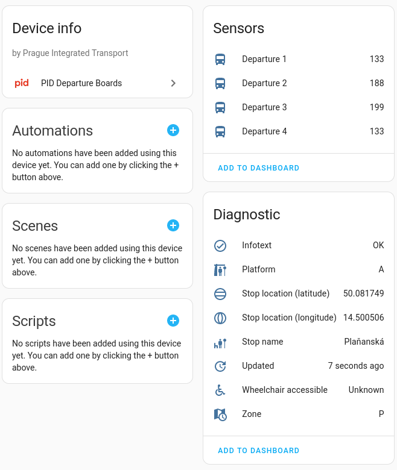
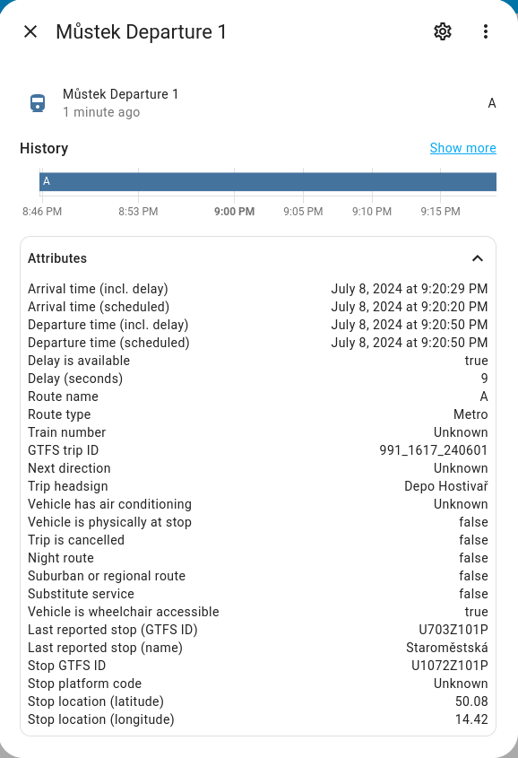
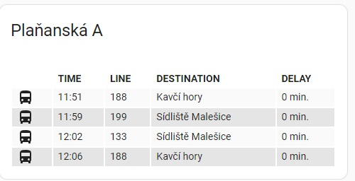

# PID Departure Board integration

A Home Assistant integration with live departure boards for stops of the Prague Integrated Transport ([PID](https://pid.cz/)): metro, trams, buses, trains, ferries and the Petřín funicular. Data come from the [Golemio API](https://api.golemio.cz/pid/docs/openapi/) and include real-time delays, cancellations and service alerts.

Each departure board is one stop platform and becomes a device in Home Assistant. Any number of boards can be added.

| Device page                                        |                       Sensor attributes                        |
|:---------------------------------------------------|:--------------------------------------------------------------:|
|  |  |

## Requirements

- Home Assistant 2024.11 or newer
- A free Golemio API key: [sign up here](https://api.golemio.cz/api-keys/auth/sign-up)

## Installation

### HACS (recommended)

[](https://my.home-assistant.io/redirect/hacs_repository/?owner=dvejsada&repository=PID_integration&category=Integration)

Download **PID Departure Boards** in HACS and restart Home Assistant.

### Manual

Copy the `custom_components/pid_departures` folder into the `custom_components` folder of your Home Assistant configuration and restart Home Assistant.

## Adding a departure board

[](https://my.home-assistant.io/redirect/config_flow_start/?domain=pid_departures)

Or go to **Settings → Devices & services → Add integration** and search for **PID Departure Boards**. Fill in:

| Field                          | Description |
|:-------------------------------|:------------|
| API key                        | Your Golemio API key. For further boards it is prefilled from the first one. |
| Number of departures           | How many upcoming departures the board shows, each as its own entities. |
| Stop                           | The stop and platform, e.g. *Palmovka A*. Type to search. Each platform of a stop is a separate board. |
| Number of calendar events      | How many upcoming departures the calendar shows. `0` turns the calendar events off. |
| Walking time offset (minutes)  | Shows only departures you can still reach: with `5`, departures leaving in the next five minutes are skipped. A negative value also shows departures that have just left (up to 30 minutes). |

Each stop platform can be added only once.

### Changing options

The number of departures, the number of calendar events and the walking time offset can be changed at any time with **Configure** on the board in **Settings → Devices & services → PID Departure Boards**. The board reloads with the new settings and keeps its device and entities; departure entities above the new number are removed.

### Expired API key

When the API key stops working, Home Assistant asks to re-authenticate the board in **Settings → Devices & services**. Enter a new key there and the board reloads, no need to remove it.

## Entities

Each departure board is a device with these entities. `n` is the number of the departure, `1` is the next one.

| Entity                    | Type          | Description |
|:--------------------------|:--------------|:------------|
| Next route name (n)       | sensor        | Line of the n-th departure, e.g. `188` or `B`. All details are in its attributes, see below. |
| Next departure time (n)   | sensor        | Expected departure time of the n-th departure, delay included. |
| Vehicle at stop           | calendar      | On while a vehicle is at the stop. The calendar lists the upcoming departures as events. |
| Infotext                  | binary sensor | On when PID publishes a service alert for the stop; the text is in its attributes (`text`, `text_en`). |
| Wheelchair accessible     | binary sensor | Whether the stop is wheelchair accessible. |
| Stop name, Platform, Zone, Stop location (latitude / longitude) | sensor | Information about the stop (diagnostic). |
| Updated                   | sensor        | Time of the last successful update (diagnostic). |

The data are updated once a minute.

### Departure attributes

The *Next route name* sensors carry all data of their departure as attributes:

| Attribute | Description |
|:----------|:------------|
| `route_name`, `route_type` | Line and transport type (`tram`, `metro`, `train`, `bus`, `ferry`, `funicular`, `trolleybus`). |
| `trip_headsign` | Destination of the trip. |
| `departure_time_sched`, `departure_time_est` | Scheduled and expected departure time. |
| `arrival_time_sched`, `arrival_time_est` | Scheduled and expected arrival time. |
| `is_delay_avail`, `delay_sec` | Whether real-time data are available, and the delay in seconds. |
| `is_at_stop`, `is_canceled` | Vehicle standing at the stop; trip cancelled. |
| `is_night`, `is_regional`, `is_substitute` | Night line; regional line; substitute service. |
| `is_wheelchair_accessible`, `is_air_conditioned` | Vehicle features. |
| `stop_platform` | Platform code the departure leaves from. |
| `train_number` | Train number, for trains. |
| `last_stop_name`, `last_stop_id` | Last stop the vehicle passed. |
| `trip_id`, `trip_direction`, `stop_id` | GTFS identifiers. |
| `latitude`, `longitude` | Location of the stop, so the departure is shown on the map. |

### Unavailable entities

- All entities of a board are **unavailable** while the API cannot be reached; they recover with the next successful update.
- When the API returns fewer departures than configured, e.g. late at night, the departure entities without a departure are **unavailable** until there are enough departures again.

## Dashboard

### PID Departures Card

For the dashboard there is a dedicated card in a separate repository, [PID Departures Card](https://github.com/dvejsada/PID_integration_cards). It shows a live departure board with countdowns, delays, cancellations and service alerts, can merge several platforms of a stop into one list, and is installed through HACS.

[](https://my.home-assistant.io/redirect/hacs_repository/?owner=dvejsada&repository=PID_integration_cards&category=plugin)


### Flex-table-card

The repo also includes an example card based on [Flex-table-card](https://github.com/custom-cards/flex-table-card) (`card.yaml`).

Just modify the headline and the departure entity name - number in the name shall be replaced by * to include all departures.



## Upgrading from version 2

Version 3 needs Home Assistant 2024.11 or newer. Existing boards keep their devices, entities and settings, and there is nothing to change. New in version 3: options can be changed with **Configure**, an expired API key can be replaced without removing the board, and a failed update no longer leaves old departures on display.

## Troubleshooting

- **Settings → System → Repairs → ⋮ → System information** shows whether the Golemio API can be reached from Home Assistant.
- To see the API requests and responses, enable debug logging on the integration (**Settings → Devices & services → PID Departure Boards → ⋮ → Enable debug logging**), or in `configuration.yaml`:

  ```yaml
  logger:
    logs:
      custom_components.pid_departures: debug
  ```

- Report problems in the [issues](https://github.com/dvejsada/PID_integration/issues).
